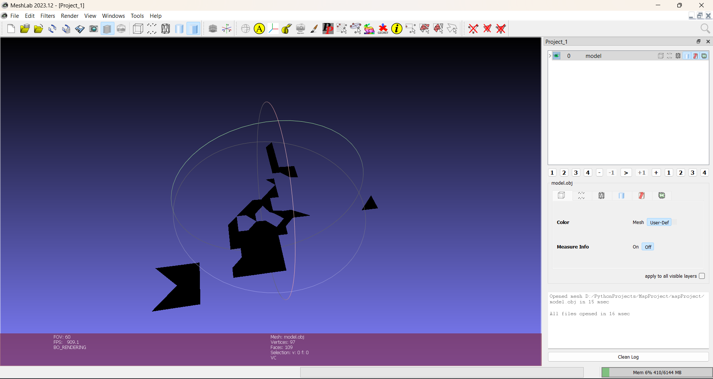
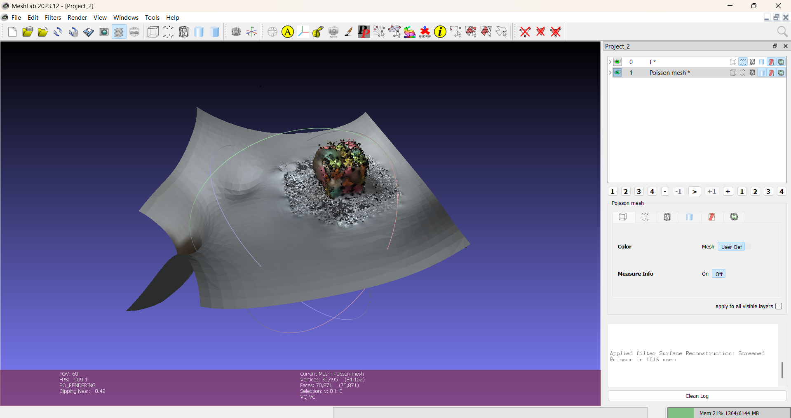
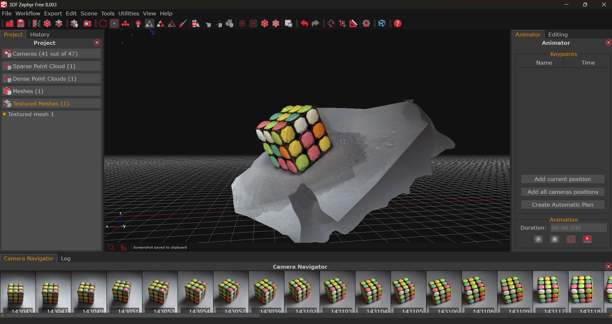

# PhotogrammetryProject

**Выполнение фотограмметрии (2D->3D) с использованием трех различных подходов**

---

**Алгоритм работы:**
### на вход подаются специально подготовленные фотографии объекта

### три подхода обработки изображений
* полностью собственная программа на PYTHON (упрощенная) -> загрузка изображений -> обнаружение точек по ORB -> проверка сходства точек между изображениями -> триангуляция -> построение меша

* COLMAP через подпроцессы PYTHON -> запуск COLMAP через вызовы subprocess

* стороннее ПО = 3DF Zephyr -> не является частью моей разработки

---

**Условия использования:**

*Данный проект разрешается использовать и распространять только с указанием автора (CasualMan228 или ConusGames)*